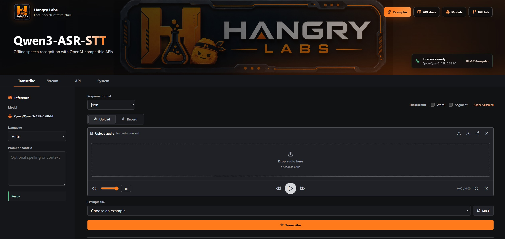

# Hangry Labs Qwen3-ASR-STT

Docker-first speech-to-text packaging for Qwen3-ASR with a local browser UI and OpenAI-compatible transcription API.

This Hangry Labs fork is built for local inference. The goal is simple: pull or build a container, run it with GPU support, open the UI or call the API, and transcribe speech without sending audio to a hosted service.

<p>
  
</p>

## What This Project Provides

- Local browser UI for upload, recording, realtime microphone transcription, API status, and GPU visibility
- OpenAI-compatible `/v1/audio/transcriptions` endpoint for applications and automation
- Experimental local realtime transcription session endpoints used by the UI
- Docker full image target with Qwen3-ASR assets baked or prefetched at build time
- Docker tiny image target for persistent cache-volume workflows
- Python 3.13 runtime with locked Linux dependencies
- vLLM backend by default for GPU inference and realtime streaming
- Benchmarks for VRAM and multilingual transcription quality
- Inference-only project scope: no training, fine-tuning, or dataset-preparation product surface

## Quick Start

Run the full baked image with NVIDIA GPU support:

```bash
docker volume create qwen3_asr_stt_vllm_cache
docker run --name qwen3-asr-stt --restart unless-stopped -p 8000:8000 --gpus all \
  -e CUDA_VISIBLE_DEVICES=0 \
  -v qwen3_asr_stt_vllm_cache:/app/.cache/vllm \
  hangrylabs/qwen3-asr-stt:latest
```

Then open:

```text
http://localhost:8000
```

API docs are available at:

```text
http://localhost:8000/docs
```

Health check:

```bash
curl http://localhost:8000/health
```

The full `latest` image includes both supported Qwen3-ASR runtime assets, `Qwen/Qwen3-ASR-0.6B` and `Qwen/Qwen3-ASR-1.7B`, plus the forced-aligner asset. Runtime defaults use the 0.6B model, vLLM, a 2048-token model context, deterministic decoding, and offline Hugging Face/Transformers flags.

Mounting `qwen3_asr_stt_vllm_cache` persists vLLM/Torch compile artifacts between container starts. Keep this cache private and trusted; remove the volume if you change GPU/runtime/model settings and need a clean compile cache. A persistent Hugging Face cache volume is optional for the full image and should be seeded from the baked image if used for offline deployments.

## Tiny Image

The tiny image keeps runtime dependencies but does not bake model assets. Use it when you want a smaller image and a persistent Hugging Face cache volume that warms on first online use:

```bash
docker volume create qwen3_asr_stt_hf_cache
docker volume create qwen3_asr_stt_vllm_cache
docker run --name qwen3-asr-stt --restart unless-stopped -p 8000:8000 --gpus all \
  -e CUDA_VISIBLE_DEVICES=0 \
  -e HF_HUB_OFFLINE=0 \
  -e TRANSFORMERS_OFFLINE=0 \
  -v qwen3_asr_stt_hf_cache:/app/.cache/huggingface \
  -v qwen3_asr_stt_vllm_cache:/app/.cache/vllm \
  hangrylabs/qwen3-asr-stt:latest_tiny
```

## Image Tags

- Full rolling image: `latest`
- Tiny rolling image: `latest_tiny`
- Full release image: `vX.Y.Z`, for example `v0.1.0`
- Tiny release image: `vX.Y.Z_tiny`, for example `v0.1.0_tiny`

Snapshot or development version tags are intentionally not published. Release tags are created only when the project is ready for a release.

## Browser UI

The included UI is meant for practical local testing:

- Upload an audio file and transcribe it
- Record audio directly in the browser
- Use bundled example files from the testbench
- Try realtime microphone transcription
- Select language or automatic language detection
- View raw response details
- Refresh API status
- Watch GPU utilization and VRAM

<p>
  
</p>

The Stream tab uses local realtime transcription sessions backed by Qwen3-ASR vLLM streaming state. It is not a full OpenAI Realtime WebSocket implementation.

Remote file upload and API calls work over normal LAN HTTP when the port is exposed. Browser microphone recording requires a secure browser origin, so use `localhost` or serve the UI over HTTPS when opening it from another machine.

## OpenAI-Compatible API

The main integration target is the local OpenAI-compatible transcription API.

### cURL

```bash
curl -X POST "http://localhost:8000/v1/audio/transcriptions" \
  -F "file=@sample.mp3" \
  -F "model=qwen3-asr" \
  -F "response_format=json"
```

Force a language when you know it:

```bash
curl -X POST "http://localhost:8000/v1/audio/transcriptions" \
  -F "file=@sample.mp3" \
  -F "model=qwen3-asr" \
  -F "language=English" \
  -F "response_format=verbose_json"
```

Text response:

```bash
curl -X POST "http://localhost:8000/v1/audio/transcriptions" \
  -F "file=@sample.mp3" \
  -F "model=qwen3-asr" \
  -F "response_format=text"
```

When `language` is omitted, the service keeps Qwen3-ASR in model-native auto-language mode. The Whisper component in this image is the Qwen audio feature extractor, not a separate language detector that can be enabled or disabled.

### Python OpenAI Client

```python
from openai import OpenAI

client = OpenAI(base_url="http://localhost:8000/v1", api_key="local")

with open("sample.mp3", "rb") as audio:
    result = client.audio.transcriptions.create(
        model="qwen3-asr",
        file=audio,
        response_format="json",
    )

print(result.text)
```

### Supported Routes

- `GET /health` (readiness-compatible alias)
- `GET /health/live`
- `GET /health/ready`
- `GET /metrics/inference`
- `GET /v1/models`
- `GET /v1/models/{model}`
- `POST /v1/audio/transcriptions`
- `GET /v1/audio/supported_languages`
- `POST /v1/realtime/transcriptions/sessions`
- `POST /v1/realtime/transcriptions/sessions/{session_id}/audio`
- `POST /v1/realtime/transcriptions/sessions/{session_id}/finish`
- `DELETE /v1/realtime/transcriptions/sessions/{session_id}`

`/v1/audio/translations` exists as an explicit not-implemented response until Qwen3-ASR translation behavior has a dedicated compatibility pass.

## Models

Default full image model:

```text
Qwen/Qwen3-ASR-0.6B
```

Larger supported ASR model:

```text
Qwen/Qwen3-ASR-1.7B
```

Optional forced aligner asset:

```text
Qwen/Qwen3-ForcedAligner-0.6B
```

The forced aligner is disabled by default so it does not occupy VRAM. Enable it when timestamp output is needed:

```bash
-e QWEN_ASR_ENABLE_ALIGNER=1
```

Known GGUF assets are tracked for future runtime work, but this service currently runs the Hugging Face/vLLM safetensors path:

- `ggml-org/Qwen3-ASR-1.7B-GGUF`
- `OpenVoiceOS/qwen3-asr-0.6b-q4-k-m`

## Runtime Settings

Every container starts the combined Gradio UI and OpenAI-compatible API on the same port.

Common environment variables:

| Variable | Default | Purpose |
| --- | --- | --- |
| `QWEN_ASR_MODEL` | `Qwen/Qwen3-ASR-0.6B` | ASR model ID |
| `QWEN_ASR_BACKEND` | `vllm` | Runtime backend |
| `QWEN_ASR_ENABLE_ALIGNER` | `0` | Load forced aligner for timestamp output |
| `QWEN_ASR_CONCURRENCY` | `2` | Maximum admitted inference requests (one active engine call plus queue) |
| `QWEN_ASR_GPU_MEMORY_UTILIZATION` | `0.22` | vLLM GPU memory budget for the default 0.6B profile |
| `QWEN_ASR_MAX_MODEL_LEN` | `2048` | vLLM max model context |
| `QWEN_ASR_MAX_NUM_BATCHED_TOKENS` | `2048` | vLLM batch-token cap |
| `QWEN_ASR_MAX_INFERENCE_BATCH_SIZE` | `2` | ASR inference batch cap |
| `QWEN_ASR_MAX_NEW_TOKENS` | `512` | Max generated tokens |
| `QWEN_ASR_STARTUP_WARMUP` | `1` | Run a decode warmup before the service reports healthy |
| `QWEN_ASR_STARTUP_WARMUP_TOKENS` | `512` | Token cap used by startup warmup |
| `QWEN_ASR_INFERENCE_TIMEOUT_SECONDS` | `120` | Deadline before readiness fails and the process recycles |
| `QWEN_ASR_INFERENCE_QUEUE_TIMEOUT_SECONDS` | `120` | Maximum wait for the single engine owner |
| `QWEN_ASR_REALTIME_SESSION_TTL_SECONDS` | `900` | Idle realtime session expiry |
| `QWEN_ASR_WATCHDOG_ENABLED` | `1` | Probe auto-language inference before readiness and periodically afterward |
| `QWEN_ASR_WATCHDOG_INTERVAL_SECONDS` | `300` | Watchdog interval |
| `QWEN_ASR_WATCHDOG_TIMEOUT_SECONDS` | `60` | Watchdog inference deadline |
| `QWEN_ASR_PERFORMANCE_PROFILE` | `balanced` | Startup/runtime graph profile |
| `VLLM_CACHE_ROOT` | `/app/.cache/vllm` | vLLM/Torch compile cache path |
| `QWEN_ASR_SSL_CERTFILE` | unset | HTTPS certificate file path inside the container |
| `QWEN_ASR_SSL_KEYFILE` | unset | HTTPS private key file path inside the container |

Inference is serialized through one owner because the offline vLLM object is synchronous. A timeout or fatal engine worker/IPC error changes readiness to HTTP 503 and terminates the process after logging diagnostics. Keep `--restart unless-stopped`, or equivalent orchestrator supervision, enabled so a clean vLLM engine is created automatically. `/health/live` remains a cheap HTTP liveness check; `/health/ready` and `/health` report inference admission state.

For the 1.7B model, increase the memory/context profile:

```bash
docker volume create qwen3_asr_stt_vllm_cache
docker run --name qwen3-asr-stt --restart unless-stopped -p 8000:8000 --gpus all \
  -e CUDA_VISIBLE_DEVICES=0 \
  -e HF_HUB_OFFLINE=1 \
  -e TRANSFORMERS_OFFLINE=1 \
  -e QWEN_ASR_MODEL=Qwen/Qwen3-ASR-1.7B \
  -e QWEN_ASR_GPU_MEMORY_UTILIZATION=0.53 \
  -e QWEN_ASR_MAX_MODEL_LEN=4096 \
  -e QWEN_ASR_MAX_NUM_BATCHED_TOKENS=2048 \
  -v qwen3_asr_stt_vllm_cache:/app/.cache/vllm \
  hangrylabs/qwen3-asr-stt:latest
```

Decoding temperature is intentionally fixed at `0` for deterministic transcription. Do not increase it for normal STT use.

### Cache Behavior

Persistent cache volumes improve repeat startups but do not preserve GPU memory state. vLLM can reuse compile artifacts under `/app/.cache/vllm`, while model weights, CUDA graphs, KV cache allocation, and warmup decode state are recreated inside each new process.

The full baked image is the offline source of truth for ASR model assets. If a persistent Hugging Face cache volume is used with the full image, seed it from the baked image instead of downloading from Hugging Face:

```bash
docker volume create qwen3_asr_stt_hf_cache
docker run --rm \
  --entrypoint sh \
  -v qwen3_asr_stt_hf_cache:/hf-cache \
  hangrylabs/qwen3-asr-stt:latest \
  -c "test -d /app/.cache/huggingface/hub && mkdir -p /hf-cache && cp -an /app/.cache/huggingface/. /hf-cache/"
```

To use browser microphone recording from another machine, mount a trusted certificate and start the server with HTTPS:

```bash
docker run --name qwen3-asr-stt --restart unless-stopped -p 8000:8000 --gpus all \
  -e CUDA_VISIBLE_DEVICES=0 \
  -e QWEN_ASR_SSL_CERTFILE=/certs/fullchain.pem \
  -e QWEN_ASR_SSL_KEYFILE=/certs/privkey.pem \
  -v /path/to/certs:/certs:ro \
  hangrylabs/qwen3-asr-stt:latest
```

## Local Development

This repository uses Taskfile workflows on the development workstation.

Planned follow-up work is tracked in [docs/roadmap.md](docs/roadmap.md).

Build the full image:

```bash
task image
```

Build the tiny image:

```bash
task image-tiny
```

Run the full image:

```bash
task imagerun
task imageweb
```

Run with local source bind-mounted for UI/API development:

```bash
task localrun
task logs
```

Run benchmark model profiles:

```bash
task deploy-api-17b
task deploy-api-06b
```

Regenerate locked Linux/Python 3.13 dependencies:

```bash
task deps
```

Preview and run a release from a clean, synchronized `main` branch:

```bash
task release DRY_RUN=1
task release
```

The release task validates package metadata, Python compilation, CodeQL results, and Dockerfile structure. It does not build or pull an image locally. It creates local release commits and an annotated `vX.Y.Z` tag, then prepares the next minor snapshot. It never pushes Git commits, tags, or Docker images; reviewed tags trigger the GitHub Actions image publication workflows only after the repository owner pushes them. Use `NEXT_VERSION=0.1.1-snapshot` to override the default next-minor snapshot, or `SKIP_VALIDATION=1` only when the same release commit has already passed the lightweight validation sequence. Test the existing Docker Hub `latest` image separately before release when runtime verification is required.

Stop containers:

```bash
task imagestop
```

## Benchmarks

Public benchmark notes live in:

- `benchmarks/vram/model_vram.md`
- `benchmarks/transcription/BENCHMARKS.md`
- `benchmarks/transcription/DETAILS.md`

The transcription benchmark corpus uses 30 Qwen3-ASR-supported languages with 10 random examples per language. Official benchmark tasks run mandatory prewarm requests and discard prewarm timing before recording measured results.

Run benchmarks against the matching API deployment:

```bash
task benchmark-transcription-17b
task benchmark-transcription-06b
```

The benchmark scores focus on transcription meaning. Punctuation, quote recovery, and expressive marks are counted as bonus signal rather than required exact text.

## Version History

### v0.1.0

- Forked Qwen3-ASR into a Hangry Labs runtime-focused project for local and private speech-to-text inference.
- Added a Python 3.13 runtime with pinned dependencies and reproducible full and tiny Docker image targets.
- Added a full offline-capable image with the Qwen3-ASR 0.6B and 1.7B models plus the optional forced-aligner asset baked into the image and validated during builds.
- Added a tiny image for smaller deployments that download models into a persistent Hugging Face cache volume.
- Made Qwen3-ASR 0.6B the default model while retaining configurable 1.7B support and model-specific GPU/context profiles.
- Added persistent vLLM/Torch compile caching, startup warmup, deterministic decoding, bounded generation, and offline runtime defaults.
- Added a combined FastAPI and Gradio service that exposes the browser UI and APIs from one container and port.
- Added a browser UI for file upload, microphone recording, bundled examples, language selection, realtime transcription, API status, response inspection, and GPU monitoring.
- Added the OpenAI-compatible `/v1/audio/transcriptions` API with JSON, verbose JSON, and text responses, automatic or forced language selection, model discovery, and supported-language routes.
- Added local realtime transcription session APIs and UI streaming with buffered appends, incremental results, finalization, deletion, and abandoned-session cleanup.
- Added optional forced alignment for timestamped transcription responses without loading the aligner into VRAM by default.
- Added HTTPS certificate and key configuration so browser microphone capture can work from secure remote origins.
- Serialized access to the synchronous offline vLLM engine to prevent unsafe overlapping inference across API, realtime, UI, warmup, and watchdog operations.
- Added inference and queue deadlines, degraded readiness state, diagnostic logging, and supervised process recycling when an engine call cannot be recovered safely.
- Added separate liveness and readiness endpoints, inference metrics, startup readiness probes, and a periodic auto-language inference watchdog.
- Added 0.6B and 1.7B VRAM and multilingual transcription benchmark workflows with mandatory prewarming and a 300-file, 30-language test corpus.
- Added Taskfile workflows for dependency locking, image builds, local deployments, model-specific benchmarks, API checks, logs, cleanup, CodeQL analysis, and guarded releases.
- Added GitHub Actions for lightweight source and packaging checks plus full/tiny Docker image publication with rolling and immutable release tags.
- Removed upstream training, fine-tuning, and dataset-preparation surfaces to keep the fork focused on inference, Docker deployment, API compatibility, UI testing, and operational reliability.

## Responsible Use and Privacy

Speech recordings and transcripts can contain personal or sensitive information. This project is designed so you can run ASR locally or inside your own infrastructure instead of sending audio to a third-party hosted API.

You are responsible for obtaining consent where required and for complying with applicable laws, regulations, workplace policies, and platform rules. Do not use this project for covert recording, surveillance, harassment, fraud, or other illegal or unethical activity.

## About Qwen3-ASR

Qwen3-ASR is an upstream Qwen speech recognition model family with:

- `Qwen/Qwen3-ASR-1.7B`
- `Qwen/Qwen3-ASR-0.6B`
- `Qwen/Qwen3-ForcedAligner-0.6B`

The ASR models support language identification and speech recognition for 30 languages plus Chinese dialect/accent categories. The forced aligner supports timestamp alignment for selected languages.

Upstream links:

- Qwen3-ASR repository: https://github.com/QwenLM/Qwen3-ASR
- Hugging Face collection: https://huggingface.co/collections/Qwen/qwen3-asr
- Qwen3-ASR blog: https://qwen.ai/blog?id=qwen3asr
- Qwen3-ASR paper: https://arxiv.org/abs/2601.21337

This repository preserves upstream attribution and license while focusing on Hangry Labs Docker packaging, local UI/API integration, benchmarking, and release tooling.

## License

This project is released under the Apache-2.0 license. See `LICENSE`.

## Citation

If you use Qwen3-ASR in research, cite the upstream Qwen3-ASR paper. Use the canonical citation from the upstream repository or paper page:

```text
https://arxiv.org/abs/2601.21337
```
