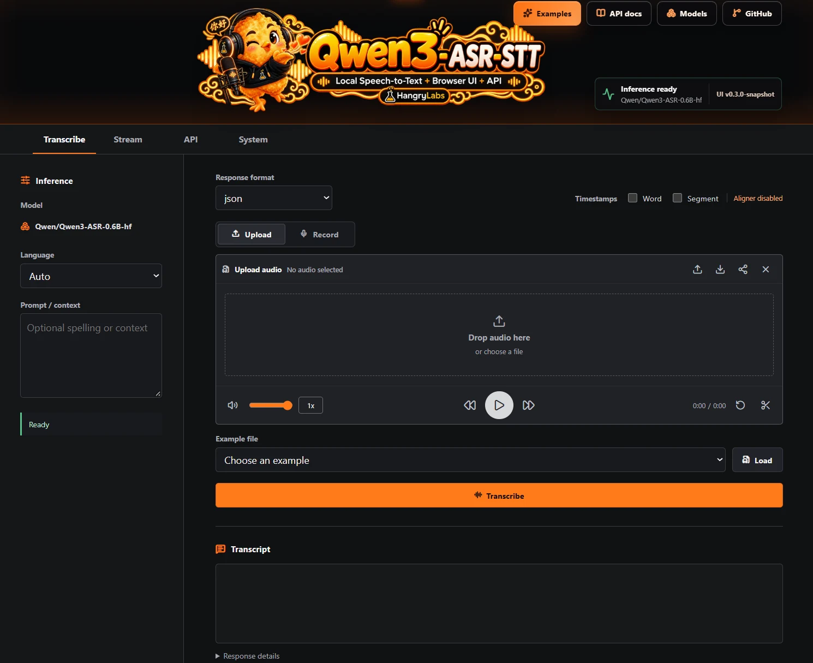

<p align="center">
  <a href="https://github.com/Hangry-Labs/Qwen3-ASR-STT">
    
  </a>
</p>

# Hangry Labs Qwen3-ASR-STT

Docker-first speech-to-text packaging for Qwen3-ASR with a local browser UI and OpenAI-compatible transcription API.

This Hangry Labs fork is built for local inference. The goal is simple: pull or build a container, run it with GPU support, open the UI or call the API, and transcribe speech without sending audio to a hosted service.

## What This Project Provides

- Local browser UI for upload, recording, realtime microphone transcription, API status, and GPU visibility
- OpenAI-compatible `/v1/audio/transcriptions` endpoint for applications and automation
- Experimental local realtime transcription session endpoints used by the UI
- Docker full image target with Qwen3-ASR assets baked or prefetched at build time
- Docker tiny image target for persistent cache-volume workflows
- Python 3.13 runtime with locked Linux dependencies
- Built-in vLLM 0.26 backend for accelerated GPU inference and realtime streaming
- Transformers 5 backend retained as an explicit diagnostic fallback
- Benchmarks for VRAM and multilingual transcription quality
- Inference-only project scope: no training, fine-tuning, or dataset-preparation product surface

## Quick Start

Run the full baked image with NVIDIA GPU support:

```bash
docker volume create qwen3_asr_stt_data
docker run --name qwen3-asr-stt --restart unless-stopped -p 8000:8000 --gpus all \
  -e CUDA_VISIBLE_DEVICES=0 \
  -v qwen3_asr_stt_data:/app/persistent \
  hangrylabs/qwen3-asr-stt:latest
```

Then open the browser UI:

```text
http://localhost:8000
```

API docs are available at:

```text
http://localhost:8000/docs
```

Health check:

```bash
curl http://localhost:8000/health
```

The full `latest` image includes `Qwen/Qwen3-ASR-0.6B-hf`, `Qwen/Qwen3-ASR-1.7B-hf`, and `Qwen/Qwen3-ForcedAligner-0.6B-hf`. Runtime defaults use the built-in vLLM Qwen3-ASR implementation with the 0.6B model, bf16 GPU weights, bounded generation, CUDA graphs, and offline Hugging Face/Transformers flags.

No network access is required after pulling the full image. A fresh named volume is automatically initialized with its baked model assets the first time Docker mounts it.

## Tiny Image

The tiny image keeps runtime dependencies but does not bake model assets. Use it when you want a smaller image and a unified persistent product volume that warms on first online use:

```bash
docker volume create qwen3_asr_stt_data
docker run --name qwen3-asr-stt --restart unless-stopped -p 8000:8000 --gpus all \
  -e CUDA_VISIBLE_DEVICES=0 \
  -e HF_HUB_OFFLINE=0 \
  -e TRANSFORMERS_OFFLINE=0 \
  -v qwen3_asr_stt_data:/app/persistent \
  hangrylabs/qwen3-asr-stt:latest_tiny
```

## Image Tags

- Full rolling image: `latest`
- Tiny rolling image: `latest_tiny`
- Full release image: `vX.Y.Z`, for example `v0.1.0`
- Tiny release image: `vX.Y.Z_tiny`, for example `v0.1.0_tiny`

Snapshot or development version tags are intentionally not published. Release tags are created only when the project is ready for a release.

## Browser UI

The primary responsive browser UI runs on port 8000 alongside the OpenAI-compatible API. Its HTML, CSS, JavaScript, icons, and WaveSurfer assets are included locally, so the full image remains usable offline after it is pulled.

The interface provides four focused views:

- **Transcribe:** upload or record audio inside a replaceable waveform editor with playback, seeking, volume, speed, trimming, and download controls; load bundled multilingual examples without changing the selected language; choose the response format and inspect the raw response.
- **Stream:** transcribe the microphone incrementally, finalize or reset a session, choose an input device, and tune the update interval, bounded audio window, and transcript-stability settings with inline explanations.
- **API:** inspect health, model, language, and inference status from the same service.
- **System:** inspect readiness plus one-second GPU history for compute load, memory activity, VRAM, temperature, power, fan speed, and graphics/memory clocks. Charts support timestamped hover inspection and switchable one- or ten-minute windows; recent history survives a browser reload. The forced aligner can be loaded, released, or configured to remain loaded across restarts, and realtime defaults can be saved for future UI and API sessions.

The branded header reports the active model, inference readiness, and UI build version. It can collapse into a compact persistent toolbar to leave more room for transcription work. Selecting Word or Segment timestamps loads the forced aligner on demand and keeps it resident for the current container session. The System tab can release that VRAM or persist an always-loaded preference in the mounted settings volume.

<p>
  
</p>

The Stream tab uses local realtime transcription sessions backed by repeated inference over a bounded recent-audio window. Once the configurable window is full, older stable transcript tokens are retained outside the model prompt while the overlapping window continues to revise its latest words. This keeps inference cost and model context bounded during long sessions. It is not a full OpenAI Realtime WebSocket implementation.

Remote file upload and API calls work over normal LAN HTTP when the port is exposed. Browser microphone recording requires a secure browser origin, so use `localhost` or serve the UI over HTTPS when opening it from another machine.

## OpenAI-Compatible API

The main integration target is the local OpenAI-compatible transcription API.

### cURL

```bash
curl -X POST "http://localhost:8000/v1/audio/transcriptions" \
  -F "file=@sample.mp3" \
  -F "model=qwen3-asr" \
  -F "response_format=json"
```

Force a language when you know it:

```bash
curl -X POST "http://localhost:8000/v1/audio/transcriptions" \
  -F "file=@sample.mp3" \
  -F "model=qwen3-asr" \
  -F "language=English" \
  -F "response_format=verbose_json"
```

Text response:

```bash
curl -X POST "http://localhost:8000/v1/audio/transcriptions" \
  -F "file=@sample.mp3" \
  -F "model=qwen3-asr" \
  -F "response_format=text"
```

When `language` is omitted, the service keeps Qwen3-ASR in model-native auto-language mode. The Whisper component in this image is the Qwen audio feature extractor, not a separate language detector that can be enabled or disabled.

### Python OpenAI Client

```python
from openai import OpenAI

client = OpenAI(base_url="http://localhost:8000/v1", api_key="local")

with open("sample.mp3", "rb") as audio:
    result = client.audio.transcriptions.create(
        model="qwen3-asr",
        file=audio,
        response_format="json",
    )

print(result.text)
```

### Supported Routes

- `GET /health` (readiness-compatible alias)
- `GET /health/live`
- `GET /health/ready`
- `GET /metrics/inference`
- `GET /system/aligner`
- `PUT /system/aligner`
- `POST /system/aligner/load`
- `POST /system/aligner/unload`
- `GET /v1/models`
- `GET /v1/models/{model}`
- `POST /v1/audio/transcriptions`
- `GET /v1/audio/supported_languages`
- `POST /v1/realtime/transcriptions/sessions`
- `POST /v1/realtime/transcriptions/sessions/{session_id}/audio`
- `POST /v1/realtime/transcriptions/sessions/{session_id}/finish`
- `DELETE /v1/realtime/transcriptions/sessions/{session_id}`

`/v1/audio/translations` exists as an explicit not-implemented response until Qwen3-ASR translation behavior has a dedicated compatibility pass.

## Models

Default full image model:

```text
Qwen/Qwen3-ASR-0.6B-hf
```

Larger supported ASR model:

```text
Qwen/Qwen3-ASR-1.7B-hf
```

Optional forced aligner asset:

```text
Qwen/Qwen3-ForcedAligner-0.6B-hf
```

The forced aligner is not loaded by default. Its first compiled load increased observed VRAM use by approximately 3.3 GiB on an RTX 5070 Ti; releasing it immediately returned about 1.8 GiB, while CUDA/compiler context remained cached until restart. Exact behavior varies by GPU, driver, and runtime settings. Selecting Word or Segment in the browser—or requesting `timestamp_granularities` through the API—loads it on demand. The browser forces `verbose_json` while timestamps are selected and schedules the aligner for release after both options remain unchecked for 60 seconds. The System tab can release it immediately or keep it loaded persistently. To make startup loading the initial default when no saved preference exists, use:

```bash
-e QWEN_ASR_ENABLE_ALIGNER=1
```

The single Qwen aligner supports Chinese, English, Cantonese, French, German, Italian, Japanese, Korean, Portuguese, Russian, and Spanish. It is not a separate model per language; ASR languages outside that list, including Turkish, remain transcribable but cannot produce Qwen forced-alignment timestamps. Japanese alignment includes the required `nagisa` tokenizer. Korean transcription remains supported, but Korean word/segment alignment is not packaged to avoid adding its GPLv3-only optional tokenizer to the Apache-2.0 image; unsupported or unavailable forced-language requests return an actionable HTTP 422 before loading the aligner.

## Runtime Settings

Every container starts the browser UI and OpenAI-compatible API together on port 8000.

Common environment variables:

| Variable | Default | Purpose |
| --- | --- | --- |
| `QWEN_ASR_MODEL` | `Qwen/Qwen3-ASR-0.6B-hf` | ASR model ID |
| `QWEN_ASR_BACKEND` | `vllm` | Inference backend; `transformers` is a diagnostic fallback |
| `QWEN_ASR_ENABLE_ALIGNER` | `0` | Initial always-load default when no saved System preference exists |
| `QWEN_ASR_SETTINGS_PATH` | `/app/persistent/app/settings.json` | Persistent UI/runtime settings file |
| `QWEN_ASR_ALIGNER_LOAD_TIMEOUT_SECONDS` | `600` | Deadline for an on-demand aligner download/load/warmup |
| `QWEN_ASR_CONCURRENCY` | `2` | Maximum admitted inference requests (one active engine call plus queue) |
| `QWEN_ASR_MAX_INFERENCE_BATCH_SIZE` | `2` | ASR inference batch cap |
| `QWEN_ASR_MAX_NEW_TOKENS` | `512` | Max generated tokens |
| `QWEN_ASR_GPU_MEMORY_UTILIZATION` | `0.25` | vLLM GPU-memory reservation fraction |
| `QWEN_ASR_MAX_MODEL_LEN` | `2048` | vLLM maximum model context |
| `QWEN_ASR_MAX_NUM_BATCHED_TOKENS` | `2048` | vLLM scheduler token budget |
| `QWEN_ASR_MAX_NUM_SEQS` | `2` | vLLM scheduler sequence cap |
| `QWEN_ASR_VLLM_DTYPE` | `bfloat16` | vLLM model dtype |
| `QWEN_ASR_BACKEND_KWARGS` | unset | JSON object with additional backend loader options |
| `QWEN_ASR_TRANSFORMERS_DTYPE` | `bfloat16` | Transformers fallback and aligner dtype |
| `QWEN_ASR_TRANSFORMERS_DEVICE_MAP` | `cuda:0` | Transformers fallback and aligner device |
| `QWEN_ASR_TORCH_COMPILE` | `1` | Compile Transformers fallback/aligner forwards with PyTorch Inductor |
| `QWEN_ASR_TORCH_COMPILE_BACKEND` | `inductor` | PyTorch compiler backend |
| `QWEN_ASR_TORCH_COMPILE_MODE` | `default` | PyTorch compiler mode |
| `QWEN_ASR_TORCH_COMPILE_FULLGRAPH` | `0` | Require the entire forward pass to compile as one graph |
| `QWEN_ASR_STARTUP_WARMUP` | `1` | Run representative decode warmups before the service reports healthy |
| `QWEN_ASR_STARTUP_WARMUP_TOKENS` | `512` | Token cap used by startup warmup |
| `QWEN_ASR_STARTUP_WARMUP_ITERATIONS` | `3` | Number of startup decode passes used to compile and stabilize generation |
| `QWEN_ASR_INFERENCE_TIMEOUT_SECONDS` | `120` | Deadline before readiness fails and the process recycles |
| `QWEN_ASR_INFERENCE_QUEUE_TIMEOUT_SECONDS` | `120` | Maximum wait for the single engine owner |
| `QWEN_ASR_REALTIME_SESSION_TTL_SECONDS` | `900` | Idle realtime session expiry |
| `QWEN_ASR_WATCHDOG_ENABLED` | `1` | Probe auto-language inference before readiness and periodically afterward |
| `QWEN_ASR_WATCHDOG_INTERVAL_SECONDS` | `300` | Watchdog interval |
| `QWEN_ASR_WATCHDOG_TIMEOUT_SECONDS` | `60` | Watchdog inference deadline |
| `QWEN_ASR_SSL_CERTFILE` | unset | HTTPS certificate file path inside the container |
| `QWEN_ASR_SSL_KEYFILE` | unset | HTTPS private key file path inside the container |

The System tab writes the safe operator-controlled values to `/app/persistent/app/settings.json`:

```json
{
  "load_aligner_always": false,
  "realtime_defaults": {
    "chunk_size_sec": 2.0,
    "max_window_sec": 30.0,
    "unfixed_chunk_num": 2,
    "unfixed_token_num": 5
  }
}
```

You may edit this file while the container is stopped. Model selection, backend, GPU allocation, compilation, and health-policy settings remain environment variables because changing them requires a controlled process restart.

Inference is serialized through one owner because the offline vLLM API is synchronous. A timeout or fatal model error changes readiness to HTTP 503 and terminates the process after logging diagnostics. Keep `--restart unless-stopped`, or equivalent orchestrator supervision, enabled so the model is reloaded automatically. `/health/live` remains a cheap HTTP liveness check; `/health/ready` and `/health` report inference admission state.

For the 1.7B model, increase the memory/context profile:

```bash
docker run --name qwen3-asr-stt --restart unless-stopped -p 8000:8000 --gpus all \
  -e CUDA_VISIBLE_DEVICES=0 \
  -e HF_HUB_OFFLINE=1 \
  -e TRANSFORMERS_OFFLINE=1 \
  -e QWEN_ASR_MODEL=Qwen/Qwen3-ASR-1.7B-hf \
  hangrylabs/qwen3-asr-stt:latest
```

Decoding temperature is intentionally fixed at `0` for deterministic transcription. Do not increase it for normal STT use.

### Cache Behavior

The single `qwen3_asr_stt_data` volume stores downloaded/baked model assets, vLLM and TorchInductor compiler caches, and operator settings under `/app/persistent`. Reuse the same named volume with later image tags to preserve continuity. It does not preserve loaded GPU weights or live CUDA graph state, so startup profiling and warmup still run. Docker initializes a new named volume from the full image's baked `/app/persistent` contents automatically; the tiny image downloads into the same layout on first online use.

If you used the legacy cache/settings volumes, run this once before retiring them to carry their contents into the unified layout without downloading the models again:

```bash
docker volume create qwen3_asr_stt_data
docker run --rm --entrypoint sh \
  -v qwen3_asr_stt_hf_cache:/legacy/huggingface:ro \
  -v qwen3_asr_stt_torch_compile_cache:/legacy/torchinductor:ro \
  -v qwen3_asr_stt_vllm_cache:/legacy/vllm:ro \
  -v qwen3_asr_stt_settings:/legacy/settings:ro \
  -v qwen3_asr_stt_data:/app/persistent \
  hangrylabs/qwen3-asr-stt:latest_tiny \
  -c 'mkdir -p /app/persistent/models/huggingface /app/persistent/cache/torchinductor /app/persistent/cache/vllm /app/persistent/app && cp -an /legacy/huggingface/. /app/persistent/models/huggingface/ && cp -an /legacy/torchinductor/. /app/persistent/cache/torchinductor/ && cp -an /legacy/vllm/. /app/persistent/cache/vllm/ && cp -an /legacy/settings/. /app/persistent/app/'
```

The old volumes are left untouched. Remove them only after confirming the new container is healthy.

To use browser microphone recording from another machine, mount a trusted certificate and start the server with HTTPS:

```bash
docker run --name qwen3-asr-stt --restart unless-stopped -p 8000:8000 --gpus all \
  -e CUDA_VISIBLE_DEVICES=0 \
  -e QWEN_ASR_SSL_CERTFILE=/certs/fullchain.pem \
  -e QWEN_ASR_SSL_KEYFILE=/certs/privkey.pem \
  -v /path/to/certs:/certs:ro \
  hangrylabs/qwen3-asr-stt:latest
```

## Local Development

This repository uses Taskfile workflows on the development workstation.

The runtime is intentionally split by responsibility: `docker_entrypoint.py` resolves deployment
configuration, `server/application.py` assembles and serves the product, `server/openai_api.py`
owns API behavior, `standalone_ui/` owns browser routes and assets, and `inference/` contains the
model adapters. The supported application is always the combined Docker UI/API service.

Build the full image:

```bash
task image
```

Build the tiny image:

```bash
task image-tiny
```

Run the full image:

```bash
task imagerun
task imageweb
```

Run with local source bind-mounted for UI/API development:

```bash
task localrun
task logs
```

Run benchmark model profiles:

```bash
task deploy-api-17b
task deploy-api-06b
```

Regenerate locked Linux/Python 3.13 dependencies:

```bash
task deps
```

Preview and run a release from a clean, synchronized `main` branch:

```bash
task release DRY_RUN=1
task release
```

The release task validates package metadata, Python compilation, CodeQL results, and Dockerfile structure. It does not build or pull an image locally. It creates the release commit and annotated `vX.Y.Z` tag, prepares the next minor snapshot commit and README history section, then atomically pushes `main` and the release tag to `origin`. GitHub Actions remains solely responsible for publishing Docker images. Pass an explicit newer `NEXT_VERSION=X.Y.Z-snapshot` to override the default next-minor snapshot, or use `SKIP_VALIDATION=1` only when the same release commit has already passed the lightweight validation sequence. Test the existing Docker Hub `latest` image separately before release when dependency-backed or runtime verification is required.

Stop containers:

```bash
task imagestop
```

## Benchmarks

Public benchmark notes live in:

- `benchmarks/vram/model_vram.md`
- `benchmarks/transcription/BENCHMARKS.md`
- `benchmarks/transcription/DETAILS.md`

The transcription benchmark corpus uses 30 Qwen3-ASR-supported languages with 10 random examples per language. Official benchmark tasks run mandatory prewarm requests and discard prewarm timing before recording measured results.

Run benchmarks against the matching API deployment:

```bash
task benchmark-transcription-17b
task benchmark-transcription-06b
```

The benchmark scores focus on transcription meaning. Punctuation, quote recovery, and expressive marks are counted as bonus signal rather than required exact text.

## Version History

### v0.3.0 (in development)

- Added persistent and on-demand forced-aligner lifecycle management. Word or Segment selection can load the aligner without restarting, while the System tab can release its VRAM or keep it loaded across container replacements through the unified product data volume. Segment output is now divided into punctuation-, silence-, and duration-aware cues instead of one whole-file block.
- Added Japanese word/segment alignment support to the image, capability-aware timestamp language validation, automatic idle aligner release, forced `verbose_json` timestamp output, actionable language-tokenizer errors, persistent realtime defaults, and one unified data volume for model assets, compiler caches, and application settings across releases.
- Added a viewport-bounded Qwen3-ASR-STT brand hero that collapses into a responsive persistent header, restores its state before first paint, keeps the full loaded model available as hover detail, and links the displayed UI version to GitHub Releases. Consolidated artwork under `assets/`, converted shipped web artwork to WebP, and reduced the vendored Lucide font to the glyphs used by the workspace.
- Refined microphone workflows with automatic example loading, single-button record/stop controls for both recorded and realtime audio, responsive recording waveforms, aligned device refresh controls, and clearer recording status placement.
- Expanded the System-tab GPU monitor with one-second tracking charts for compute load, memory activity, VRAM, temperature, power, fan speed, and graphics/memory clocks. Added timestamped hover values, one- and ten-minute windows, on-demand server sampling, and browser-session history restoration.
- Extended transcription benchmarks with detected GPU identity, end-to-end request latency, audio duration, real-time factor, and realtime throughput. The refreshed 0.6B run processed 1,320.936 seconds of audio in 32.376 seconds on an RTX 5070 Ti, or 40.80 times realtime, while scoring 96.10% plus a 0.41% bonus.
- Reorganized runtime composition into a dedicated product application layer, limited the browser and API modules to their own responsibilities, colocated GPU telemetry with the UI, removed the obsolete API-only launcher and direct-library input/export compatibility paths, and pruned seven unused packages from the locked Docker dependency set.
- Polished forced-alignment workflows with timestamp choice restoration during ordinary page refreshes, automatic removal of incompatible examples, live load-completion feedback, tokenizer preloading, and dynamic-shape compilation to avoid first-use recompilation when audio or alignment language changes.
- Replaced quadratic forced-aligner timestamp repair with a stable O(N log N) implementation based on upstream PR [QwenLM/Qwen3-ASR#215](https://github.com/QwenLM/Qwen3-ASR/pull/215), preserving existing anchors and interpolation results.
- Reproduced zero-duration lexical timestamps from [QwenLM/Qwen3-ASR#197](https://github.com/QwenLM/Qwen3-ASR/issues/197) and added a model-score-aware constrained decoder fallback that preserves ordinary alignment output while resolving affected words into positive, monotonic spans.
- Profiled the cumulative realtime path from [QwenLM/Qwen3-ASR#199](https://github.com/QwenLM/Qwen3-ASR/issues/199), reproduced 4.8× latency growth and a 74-second model-context failure, and replaced unbounded accumulation with a configurable stable rolling audio/transcript window. A 120-second regression now completes with a 30-second inference cap and stable post-window update latency.

#### TODO

- [x] Port and validate the stable O(N log N) forced-aligner timestamp repair from [QwenLM/Qwen3-ASR#215](https://github.com/QwenLM/Qwen3-ASR/pull/215).
- [x] Reproduce and resolve zero-duration aligned words reported in [QwenLM/Qwen3-ASR#197](https://github.com/QwenLM/Qwen3-ASR/issues/197) by selecting the highest-scoring valid boundary path instead of inventing timestamp offsets.
- [x] Profile realtime latency growth and implement bounded stable-window audio/transcript processing for [QwenLM/Qwen3-ASR#199](https://github.com/QwenLM/Qwen3-ASR/issues/199).
- [ ] Build a silence, noise, echo, and weak-speech regression set before deciding whether optional VAD should address [QwenLM/Qwen3-ASR#165](https://github.com/QwenLM/Qwen3-ASR/issues/165).
- [ ] Measure prompt/context leakage from [QwenLM/Qwen3-ASR#186](https://github.com/QwenLM/Qwen3-ASR/issues/186) and improve UI guidance or limits before considering a separate hotword model.

Development images use the rolling tags published from `main`:

**Standard image**

```bash
docker volume create qwen3_asr_stt_data
docker run --name qwen3-asr-stt-v0-3-0 --restart unless-stopped -p 8000:8000 --gpus all -v qwen3_asr_stt_data:/app/persistent hangrylabs/qwen3-asr-stt:latest
```

**Tiny image**

```bash
docker volume create qwen3_asr_stt_data
docker run --name qwen3-asr-stt-v0-3-0-tiny --restart unless-stopped -p 8000:8000 --gpus all -e HF_HUB_OFFLINE=0 -e TRANSFORMERS_OFFLINE=0 -v qwen3_asr_stt_data:/app/persistent hangrylabs/qwen3-asr-stt:latest_tiny
```

### v0.2.0

- Synchronized the maintained Hangry Labs runtime with upstream Qwen3-ASR through upstream commit `7c6daf7`.
- Migrated the runtime to the upstream Hugging Face Qwen3-ASR and forced-aligner implementations.
- Replaced the legacy checkpoints with `Qwen3-ASR-0.6B-hf`, `Qwen3-ASR-1.7B-hf`, and `Qwen3-ForcedAligner-0.6B-hf` in the offline image.
- Replaced the deleted custom vLLM model/plugin with vLLM 0.26's maintained built-in Qwen3-ASR implementation and made it the production default.
- Corrected a major migration regression where production inference had temporarily fallen back to native Transformers instead of the optimized graph-backed vLLM path.
- Upgraded and locked PyTorch 2.11 CUDA 13.0, Transformers 5.14, and vLLM 0.26, including a compiler/runtime compatibility pin for FlashInfer JIT builds.
- Restored full-and-piecewise CUDA graph execution, FlashInfer kernels, deterministic decoding, representative auto/forced-language warmups, and persistent vLLM, FlashInfer, and TorchInductor caches.
- Reduced the 0.6B 300-file transcription benchmark from 277.136 seconds on the initial v0.2 native Transformers path to 31.497 seconds on the integrated vLLM path. This is 43% faster than the historical v0.1 result of 55.382 seconds while maintaining comparable quality at 96.05 versus 95.99.
- Preserved realtime decoding, optional native forced alignment, serialized inference, readiness, watchdog, and process-recovery safeguards.
- Replaced the previous Gradio interface with a responsive local browser UI on the main port 8000, removing the second UI listener and Gradio runtime dependency.
- Added the branded model/readiness/version header, replaceable waveform upload and recording editors, playback and trimming tools, multilingual examples, direct aligner capability feedback, realtime-setting explanations, API status, and GPU visibility.
- Vendored Lucide and WaveSurfer assets for offline UI use and preserved their licenses in the distribution and third-party notices.
- Removed the legacy `qwen_asr.server.app` module and direct-library example scripts so the supported product surface is the Docker-first standalone UI and OpenAI-compatible API.

Run this release with either image variant:

**Standard image**

```bash
docker run --name qwen3-asr-stt-v0-2-0 --restart unless-stopped -p 8000:8000 --gpus all hangrylabs/qwen3-asr-stt:v0.2.0
```

**Tiny image**

```bash
docker volume create qwen3_asr_stt_v0_2_0_hf_cache
docker run --name qwen3-asr-stt-v0-2-0-tiny --restart unless-stopped -p 8000:8000 --gpus all -e HF_HUB_OFFLINE=0 -e TRANSFORMERS_OFFLINE=0 -v qwen3_asr_stt_v0_2_0_hf_cache:/app/.cache/huggingface hangrylabs/qwen3-asr-stt:v0.2.0_tiny
```

### v0.1.0

- Forked Qwen3-ASR into a Hangry Labs runtime-focused project for local and private speech-to-text inference.
- Added a Python 3.13 runtime with pinned dependencies and reproducible full and tiny Docker image targets.
- Added a full offline-capable image with the Qwen3-ASR 0.6B and 1.7B models plus the optional forced-aligner asset baked into the image and validated during builds.
- Added a tiny image for smaller deployments that download models into a persistent Hugging Face cache volume.
- Made Qwen3-ASR 0.6B the default model while retaining configurable 1.7B support and model-specific GPU/context profiles.
- Added persistent vLLM/Torch compile caching, startup warmup, deterministic decoding, bounded generation, and offline runtime defaults.
- Added a combined FastAPI and Gradio service that exposes the browser UI and APIs from one container and port.
- Added a browser UI for file upload, microphone recording, bundled examples, language selection, realtime transcription, API status, response inspection, and GPU monitoring.
- Added the OpenAI-compatible `/v1/audio/transcriptions` API with JSON, verbose JSON, and text responses, automatic or forced language selection, model discovery, and supported-language routes.
- Added local realtime transcription session APIs and UI streaming with buffered appends, incremental results, finalization, deletion, and abandoned-session cleanup.
- Added optional forced alignment for timestamped transcription responses without loading the aligner into VRAM by default.
- Added HTTPS certificate and key configuration so browser microphone capture can work from secure remote origins.
- Serialized access to the synchronous offline vLLM engine to prevent unsafe overlapping inference across API, realtime, UI, warmup, and watchdog operations.
- Added inference and queue deadlines, degraded readiness state, diagnostic logging, and supervised process recycling when an engine call cannot be recovered safely.
- Added separate liveness and readiness endpoints, inference metrics, startup readiness probes, and a periodic auto-language inference watchdog.
- Added 0.6B and 1.7B VRAM and multilingual transcription benchmark workflows with mandatory prewarming and a 300-file, 30-language test corpus.
- Added Taskfile workflows for dependency locking, image builds, local deployments, model-specific benchmarks, API checks, logs, cleanup, CodeQL analysis, and guarded releases.
- Added GitHub Actions for lightweight source and packaging checks plus full/tiny Docker image publication with rolling and immutable release tags.
- Removed upstream training, fine-tuning, and dataset-preparation surfaces to keep the fork focused on inference, Docker deployment, API compatibility, UI testing, and operational reliability.

Run this release with either image variant:

**Standard image**

```bash
docker run --name qwen3-asr-stt-v0-1-0 --restart unless-stopped -p 8000:8000 --gpus all hangrylabs/qwen3-asr-stt:v0.1.0
```

**Tiny image**

```bash
docker volume create qwen3_asr_stt_v0_1_0_hf_cache
docker run --name qwen3-asr-stt-v0-1-0-tiny --restart unless-stopped -p 8000:8000 --gpus all -e HF_HUB_OFFLINE=0 -e TRANSFORMERS_OFFLINE=0 -v qwen3_asr_stt_v0_1_0_hf_cache:/app/.cache/huggingface hangrylabs/qwen3-asr-stt:v0.1.0_tiny
```

## Responsible Use and Privacy

Speech recordings and transcripts can contain personal or sensitive information. This project is designed so you can run ASR locally or inside your own infrastructure instead of sending audio to a third-party hosted API.

You are responsible for obtaining consent where required and for complying with applicable laws, regulations, workplace policies, and platform rules. Do not use this project for covert recording, surveillance, harassment, fraud, or other illegal or unethical activity.

## About Qwen3-ASR

Qwen3-ASR is an upstream Qwen speech recognition model family with:

- `Qwen/Qwen3-ASR-1.7B-hf`
- `Qwen/Qwen3-ASR-0.6B-hf`
- `Qwen/Qwen3-ForcedAligner-0.6B-hf`

The ASR models support language identification and speech recognition for 30 languages plus Chinese dialect/accent categories. The forced aligner supports timestamp alignment for selected languages.

Upstream links:

- Qwen3-ASR repository: https://github.com/QwenLM/Qwen3-ASR
- Hugging Face collection: https://huggingface.co/collections/Qwen/qwen3-asr
- Qwen3-ASR blog: https://qwen.ai/blog?id=qwen3asr
- Qwen3-ASR paper: https://arxiv.org/abs/2601.21337

This repository preserves upstream attribution and license while focusing on Hangry Labs Docker packaging, local UI/API integration, benchmarking, and release tooling.

## License

This project is released under the Apache-2.0 license. See [`LICENSE`](LICENSE).
The standalone browser UI includes permissively licensed third-party assets;
see [`THIRD_PARTY_NOTICES.md`](THIRD_PARTY_NOTICES.md) for attribution and the
locations of their complete license texts.

## Citation

If you use Qwen3-ASR in research, cite the upstream Qwen3-ASR paper. Use the canonical citation from the upstream repository or paper page:

```text
https://arxiv.org/abs/2601.21337
```
